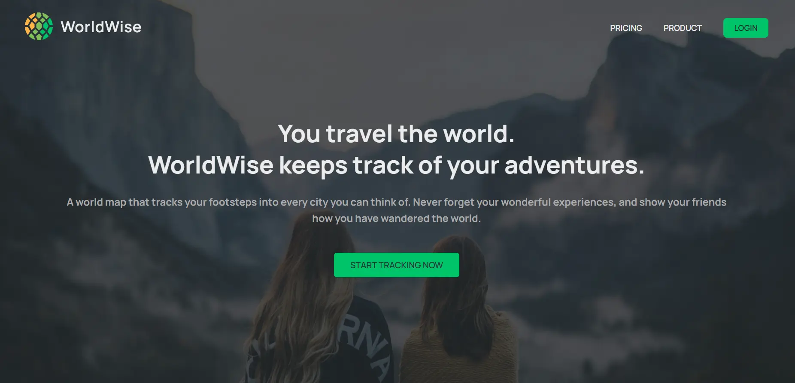

# WorldWise

WorldWise is a web application designed to help you track your travels around the world. Built as part of Jonas Schmedtmann's Udemy course, this app allows users to log their travel history by selecting cities and countries on a map and saving them to their account.

## Features

- **User Authentication:** Fake login to access travel history.
- **Interactive Map:** Navigate the map to select cities you've visited.
- **Travel History:** View your travel history categorized by cities and countries.
- **Add Notes:** Add notes and timestamps to your travel entries.
- **Responsive Design:** Optimized for both desktop and mobile use.
- **Geolocation:** Use the "Get Your Location" button to quickly add your current location.

## How It Works

1. **Login:** Open the web app and log in with the placed account.
2. **Map Navigation:** On the left side, you'll see a map. Navigate and select the city you have visited.
3. **Add Travel Entry:** Upon selecting a city, a menu will appear asking for the date of visit and any notes. Click the "Add" button to save the entry.
4. **View Travel History:** On the right side, the menu displays your travel history with two navigation items:
   - **Cities:** Shows the cities you have visited.
   - **Countries:** Shows the countries you have visited.

## Demo



## Technologies Used

- **Frontend:**

  - React
  - React Hooks: `useContext`, `useCallback`, `useMemo`, `memo`
  - React Router
  - Lazy Loading for performance enhancement
  - CSS Modules for styling
  - Vite for development

- **Backend:**

  - JSON-SERVER for mock backend

- **Other Tools:**
  - Leaflet for the interactive map
  - Geolocation API for getting the user's current location

## What I Have Learned

While building WorldWise, I have gained hands-on experience with:

- **React Hooks:**

  - `useContext` for state management across components.
  - `useCallback` and `useMemo` for optimizing performance.
  - `memo` for preventing unnecessary re-renders.
  - Lazy loading components to improve initial load time.

- **Leaflet Integration:** Implementing an interactive map to enhance user experience.
- **Geolocation API:** Using the Geolocation API to get the user's current location.

## Getting Started

To get a local copy up and running, follow these steps:

### Prerequisites

- Node.js installed on your machine

### Installation

1. **Clone the repo:**
   ```sh
   git clone https://github.com/3bdulrahmn69/worldWise
   ```
2. **Navigate to the directory:**
   ```sh
    cd worldWise
   ```
3. **Install dependencies:**
   ```sh
   npm install
   ```
4. **Run the app:**
   ```sh
   npm run dev
   ```
5. **Run the server:**
   ```sh
   npm run server
   ```

## Acknowledgements

- [Jonas Schmedtmann](https://www.udemy.com/user/jonasschmedtmann): For creating the course and providing guidance.
- [Leaflet](https://leafletjs.com/): For the interactive map library.
- [JSON-SERVER](https://github.com/typicode/json-server) : For the mock backend server.

## Contact

- Abdulrahman Moussa: [Website](https://www.3bdulrahmn.tech) - [LinkedIn](https://www.linkedin.com/in/3bdulrahmn69/) - [Twitter](https://twitter.com/3bdulrahmn69)

## License

Distributed under the MIT License. See `LICENSE` for more information.
